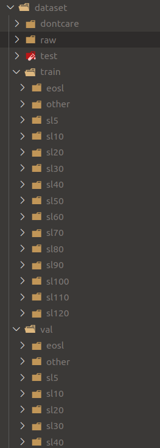

### Traffic sign classification

The purpose of this project is to train a traffic sign classification model for an advanced driver-assistance system. [More about this project](https://aicurious.io/posts/adas-jetson-nano-intro-and-hardware/). The inference code was integrated in [this repository](https://github.com/vietanhdev/car-smart-cam).

#### Step 1: Initialize environment

Create anaconda enviroment:

```conda create --name <ENVIROMENT_NAME> python=3.6```

Activate created environment and install all requirements:

```pip install requirements.txt```


#### Step 2: Train the models

- Prepare dataset like below structure:



- Train the model:

```
python train.py
```

#### Step 3: Convert to UFF

- Modify model paths in `convert_h5_to_pb.py` and `convert_pb_to_uff.py`.

- Convert `.h5` model to `.pb`, and finnally `.uff`: 

```
pip install requirements-h5-to-uff.txt
python convert_h5_to_pb.py
python convert_pb_to_uff.py
```